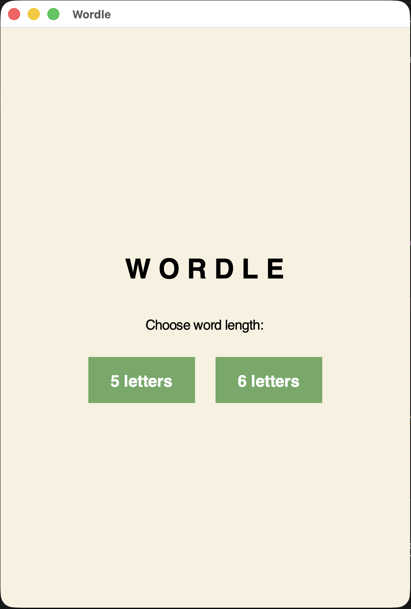
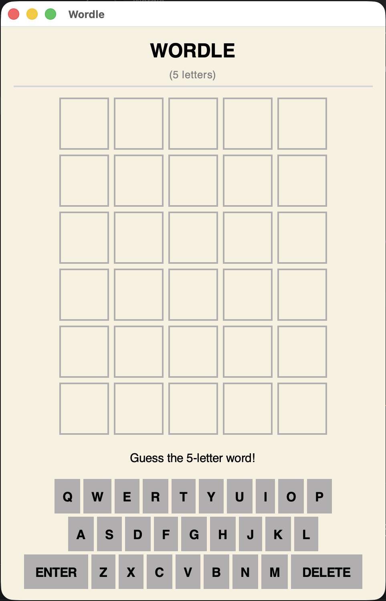
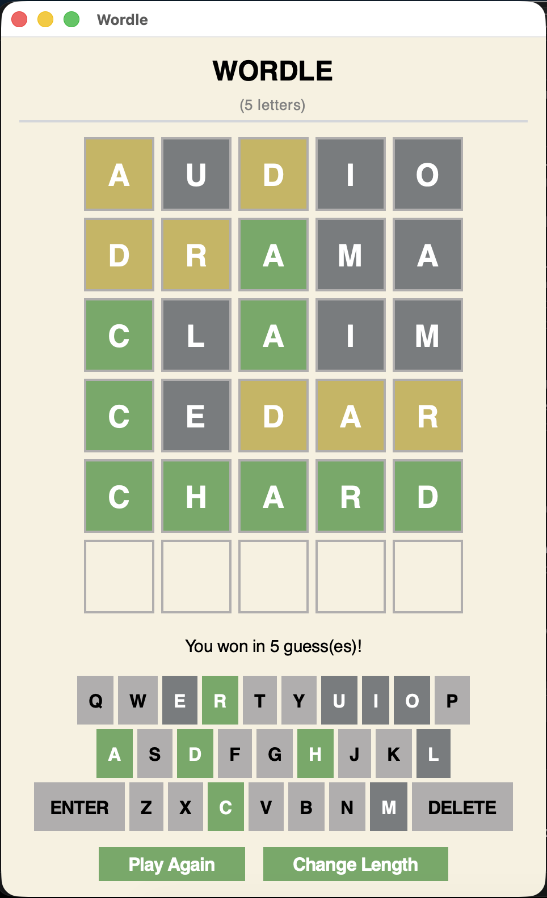
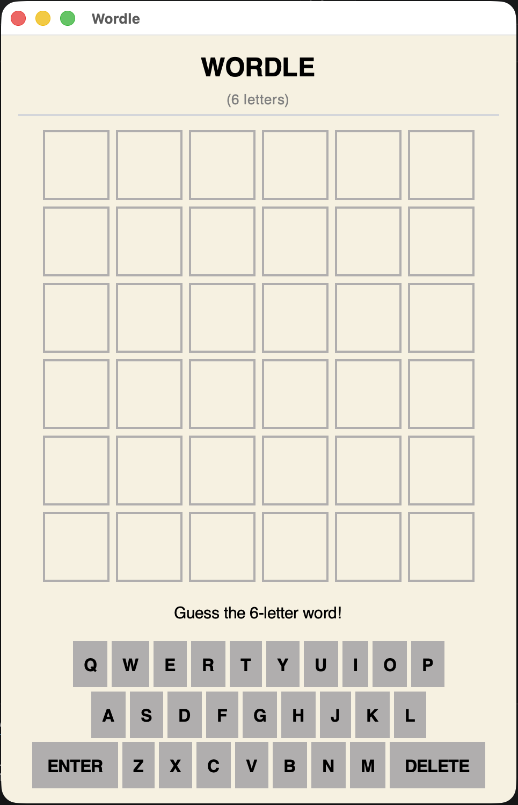
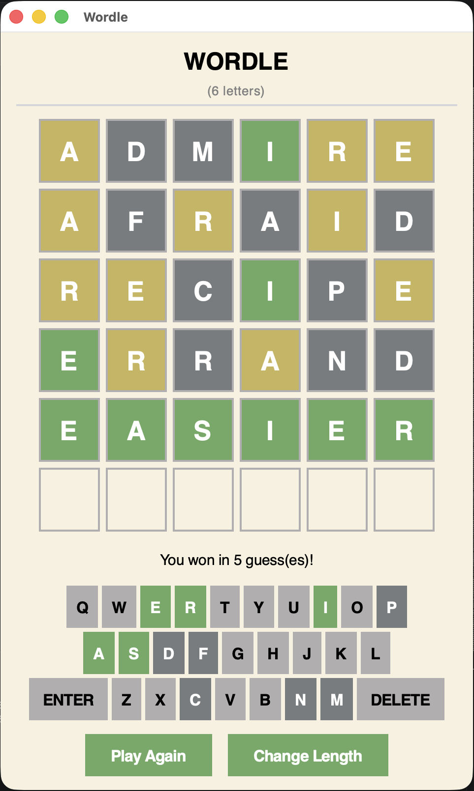

# Wordle Reconstructed
A standalone Python and Tkinter application built using the Model-View-Controller design pattern, supporting both 5-letter and 6-letter Wordle puzzles. Wordle Reconstructed allows users to play an unlimited number of puzzles, offering more variety and flexibility.

## Developed With
- **Python**: 3.9.6
- **Tkinter**: 8.5

## Project Structure

```
├── main.py          # Application home screen
├── model.py         # Manages Wordle data, puzzle logic, and feedback
├── view.py          # Builds Tkinter UI and manages widgets
├── controller.py    # Handles user action, coordinates between Model and View
├── words.txt        # 5-letter word list
└── words6.txt       # 6-letter word list
```
## How to Play
1. **Select Word Length**: Upon launching the application, users select between either a 5-letter (classic) or 6-letter Wordle.
2. **Objective**: Correctly guess the target word in 6 attempts.
3. **Type Your Guess**: Use either the interactive on-screen keyboard or your physical keyboard.
4. **Interpret Letter Feedback**: 
    - Green: The letter is correct and in the correct position. 
    - Yellow: The letter is in the target word, but is placed in the wrong position.
    - Dark Gray: The letter is not in the target word.
5. **Wordle Outcome**: The target word must be guessed within 6 attempts to win. Otherwise, the answer is revealed at the end.
6. **Post Game**: After the round ends, the user has the option to click "Play Again" to start a new round with the same word length, or "Change Length" to return to the home page and select a different puzzle.

## User Interface
### **Home Page**


### 5-letter Wordle
| Blank | Completed |
|---------|---------|
|  |  |

### 6-letter Wordle
| Blank | Completed |
|---------|---------|
|  |  |
